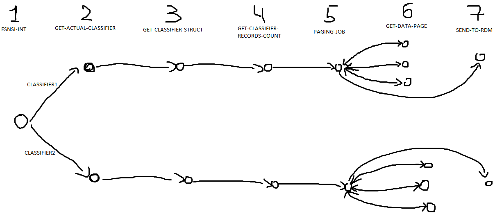

 ## Модуль для синхронизации со справочниками ЕСНСИ.
- Описание настроек:
    - esnsi.smev-adapter.ws.url -- адрес, по которому расположен адаптер СМЭВ.
    - esnsi.classifier.codes -- список кодов справочников, которые необходимо синхронизировать с рдм.
    - esnsi.sync.execution.expression -- как часто Quartz будет запускать общую синхронизацию справочников
    - esnsi.smev.adapter.fetch.interval -- как часто отдельный MessageFetcher будет опрашивать адаптер СМЭВ на наличие ответа.
    - esnsi.classifier.downloading.num-workers -- когда стадия пайплайна дойдет до `GET_DATA`, координатор PagingJob создаст такое кол-во 
    работников и распределит работу между ними.
    - esnsi.sync.num-retries -- кол - во попыток, которое дается очередному Job-у, чтобы закончить свою работу. Если Job их исчерпает -- синхронизация конкретного справочника будет завершена.
    Нет смысла делать это число слишком большим. Если Job свалился 5 раз, вероятность, что он свалится в последующие попытки раз очень высокая. 
    - esnsi.sync.job-timeout-minutes -- таймаут в минутах, по превышению которого любым из Job-ов, относящихся к конкретному справочнику, будет остановлена его синхронизация.
    - esnsi.sync.date-formats -- форматы дат в ЕСНСИ, через запятую, заданные так, чтобы `DateFormatter.ofPattern()` не свалился с ошибкой 
    - esnsi.buffer-cleaner.cron -- с какой частотой будет запускаться Job, который подчищает безхозные сообщения и вызывает по ним acknowledged у адаптера.
    - esnsi.smev-adapter.message.time-filter-minutes -- какое время в минутах должно пройти между текущим временем и получением сообщения, чтобы оно было помечено как безхозное и было удалено. 
    - esnsi.sync.job-schedule.seconds -- с какой частотой в секундах Job-ы будут просыпаться и проверять, не пришло ли сообщение
    - esnsi.sync.disable.msg-fetcher -- если надо продебажить что - то, можно отключить MessageFetcher-а, который в противном случае будет забирать все ответы из адаптера.
    
    
## Как это работает:
Есть абстрактный класс: `AbstractEsnsiDictionaryProcessingJob`. От него наследуются все джобы по скачиванию справочников из ЕСНСИ. В нем прошита логика по таймаутам, ретраям, ack-ам сообщений предыдущих джобов и т.д.  
Есть еще `EsnsiIntegrationJob`, который стартует синхронизацию всех справочников.    
Весь пайплайн выглядит так (красные линие -- это отправка запроса к адаптеру, синие линие -- периодический пулл из адаптера на предмет ответа, зеленые стрелки -- порождение джобов другого джоба):   
`PagingJob` раскидывает работу по нескольким `GetDataPageJob`-ам. `GetDataPageJob` также является единственным промежуточным, не порождающим джобом во всей этой цепочке.  
Самой по себе логики в каждом из джобов не так уж и много. Вся эта сложность вызвана тем, как приходиться обмениваться сообщениями с ЕСНСИ (необходимо периодически пуллить сообщения).